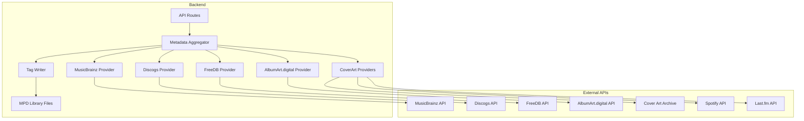

# Metadata Search Implementation Plan

## Overview
Implement metadata fetching from external music databases (Discogs, FreeDB, MusicBrainz, AlbumArt.digital) to fix or complement existing MPD metadata.

## Architecture



## Phased Implementation Plan

### Phase 1: Provider Interface & MusicBrainz Provider

**File: `backend/internal/metadata/provider.go`**
```go
// Provider interface for metadata sources
type Provider interface {
    Name() string
    Search(ctx context.Context, artist, album string) ([]MetadataCandidate, error)
    GetReleaseDetails(ctx context.Context, externalID string) (*MetadataCandidate, error)
    SearchCoverArt(ctx context.Context, artist, album string) ([]CoverArtCandidate, error)
}
```

**File: `backend/internal/metadata/musicbrainz.go`**
- Implement MusicBrainz API search (free, no API key required)
- Search by artist + album or generic query
- Return release metadata with track listings
- Use MusicBrainz Cover Art Archive for cover art

### Phase 2: FreeDB Provider

**File: `backend/internal/metadata/freedb.go`**
- Implement FreeDB protocol (HTTP-based)
- Search by artist/album or CD TOC (disc signature)
- Return track listings and genre/year info
- Note: FreeDB is less maintained but still useful for older CDs

### Phase 3: Discogs Provider Enhancement

**File: `backend/internal/metadata/discogs.go`**
- Complete the existing implementation
- Add API key support (optional, higher rate limits)
- Search releases with pagination
- Get detailed release information including track credits

### Phase 4: AlbumArt.digital Provider

**File: `backend/internal/metadata/albumart_digital.go`**
- Implement AlbumArt.digital API
- Focus on cover art primarily
- Also returns metadata when available

### Phase 5: Metadata Aggregator

**File: `backend/internal/metadata/aggregator.go`**
```go
type Aggregator struct {
    providers []Provider
}

func (a *Aggregator) Search(ctx context.Context, artist, album string, providers []string) ([]MetadataCandidate, error)
func (a *Aggregator) GetReleaseDetails(ctx context.Context, source, externalID string) (*MetadataCandidate, error)
func (a *Aggregator) SearchCoverArt(ctx context.Context, artist, album string) ([]CoverArtCandidate, error)
```

### Phase 6: Tag Writing Capability

**File: `backend/internal/metadata/tagwriter.go`**
- Use `github.com/wtolson/go-taglib` for reading/writing tags
- Support ID3v1, ID3v2.3, ID3v2.4, and Vorbis comments (FLAC/OGG)
- Write metadata: artist, album, title, track number, disc number, year, genre
- Write embedded cover art (if supported by format)

### Phase 7: Backend API Endpoints

**Existing endpoints (to be completed):**
- `GET /api/metadata/search?artist=X&album=Y` - Search metadata
- `GET /api/metadata/details?source=X&externalId=Y` - Get detailed metadata
- `POST /api/metadata/apply` - Apply metadata to library files
- `GET /api/coverart/candidates` - Get cover art candidates
- `POST /api/coverart/apply` - Apply cover art to library files

### Phase 8: Configuration

**File: `backend/internal/config/config.go`**
```go
type Config struct {
    // ... existing fields
    MetadataProviders []string `json:"metadataProviders"`
    DiscogsToken      string   `json:"discogsToken,omitempty"`
    MusicBrainzEnabled bool    `json:"musicBrainzEnabled"`
    FreeDBEnabled     bool     `json:"freeDbEnabled"`
    CoverArtProviders []string `json:"coverArtProviders"`
}
```

### Phase 9: Frontend Integration

**Files to create/modify:**
- `frontend/src/components/MetadataSearchModal.vue` - Modal for metadata search
- `frontend/src/stores/mpdStore.js` - Add metadata actions
- `frontend/src/views/AlbumDetailView.vue` - Add "Find Metadata" button
- `frontend/src/services/metadata.js` - API service for metadata operations

### Phase 10: Testing & Documentation

- Unit tests for each provider
- Integration tests with mock MPD
- API documentation in `docs/`
- Configuration examples

## Implementation Priority

1. **MusicBrainz** - Free, comprehensive, no auth required
2. **Tag Writer** - Essential for applying metadata
3. **Aggregator** - Coordinates all providers
4. **Discogs** - Rich metadata, optional token
5. **AlbumArt.digital** - Good for cover art
6. **FreeDB** - Older CDs support
7. **Frontend UI** - User interaction layer

## Key Considerations

- **Rate Limiting**: Implement backoff for API calls
- **Caching**: Cache search results to reduce API calls
- **Fallback Chain**: If one provider fails, try next
- **Confidence Scoring**: Rank results by match quality
- **Dry Run Mode**: Allow preview before applying
- **Backup**: Suggest backing up files before applying tags

## File Changes Summary

| File | Action |
|------|--------|
| `backend/internal/metadata/provider.go` | Create |
| `backend/internal/metadata/musicbrainz.go` | Create |
| `backend/internal/metadata/freedb.go` | Create |
| `backend/internal/metadata/albumart_digital.go` | Create |
| `backend/internal/metadata/discogs.go` | Complete |
| `backend/internal/metadata/aggregator.go` | Create |
| `backend/internal/metadata/tagwriter.go` | Create |
| `backend/internal/config/config.go` | Update |
| `backend/internal/api/handlers.go` | Update handlers |
| `frontend/src/components/MetadataSearchModal.vue` | Create |
| `frontend/src/stores/mpdStore.js` | Update |
| `frontend/src/services/metadata.js` | Create |
